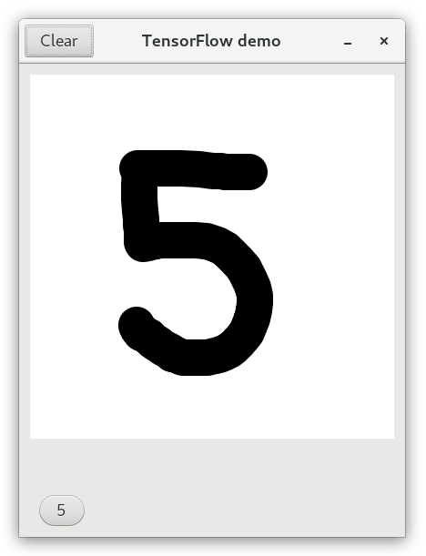

This small app aims to demonstrate how machine learning can be integrated into Linux desktop applications.

It uses the [TensorFlow Lite](https://www.tensorflow.org/lite) library which was created to run machine learning models on mobile devices, and by extension also desktops.

### Building

The app can either be built with Flatpak using the provided manifest file, or using the following command:

	valac main.vala --pkg gtk+-3.0 --pkg tflite

For this to work, you need to install the [libtensorflowlite package](https://github.com/albert-tomanek/tflite-package/) first.

If you don't want to compile stuff you can **install the flatpak bundle** found in the Releases section, and then run it like so:

	flatpak run org.tensorflow.lite.examples.mnist

### API
The libtensorflowlite package provides both the original [C bindings](https://github.com/tensorflow/tensorflow/blob/master/tensorflow/lite/c/c_api.h) that the library exports as well as a [Vala wrapper](https://github.com/albert-tomanek/tflite-package/blob/master/template/usr/share/vala/vapi/tflite.vapi). 

Example usage for Vala (as per [this guide](https://www.tensorflow.org/lite/guide/inference)):

```cs
// Load model
TFLite.Model? model = TFLite.Model.from_file("model.tflite");

// Initialize an interpreter with the model
var intrp = new TFLite.Interpreter(model, null);

// Allocate memory for the model's tensors
intrp.allocate_tensors();

float[] input      = // ...
float[] prediction = new float[10];		// You should know this from the model you're using

// Copy the input data to the input Tensor.
intrp.get_input_tensor(0).copy_from_buffer((uint8[]) input);

// Run inference by invoking the Interpreter.
intrp.invoke();

// Copy output in order to use results
intrp.get_output_tensor(0).copy_to_buffer(prediction, prediction.length * sizeof(float));
```

More examples can be found [here](https://www.tensorflow.org/lite/tutorials).

### Converting h5 files for use with TFLite

Many pre-trained models are available on sites like [ModelZoo](http://www.modelzoo.co/) or the [TensorFlow Hub](https://tfhub.dev/) (or the [example models](https://www.tensorflow.org/lite/examples)). They're usually distributed in the `.h5` format and you need to convert them to the more compact `.tflite` format.

To convert a model saved as a .h5 file to TFLite's format (supposing it was created using Keras), you need to do the following in Python:

```py
import tensorflow as tf
m = tf.keras.models.load_model('mnist.h5')
converter = tf.lite.TFLiteConverter.from_keras_model(m)
tflite_model = converter.convert()
open("mnist.tflite", "wb").write(tflite_model)
```

---

Weights for the demo came from here:  
[https://www.kaggle.com/josephassaker/cnn-mnist-digit-classification/output?select=best_model.hdf5](https://www.kaggle.com/josephassaker/cnn-mnist-digit-classification/output?select=best_model.hdf5)
